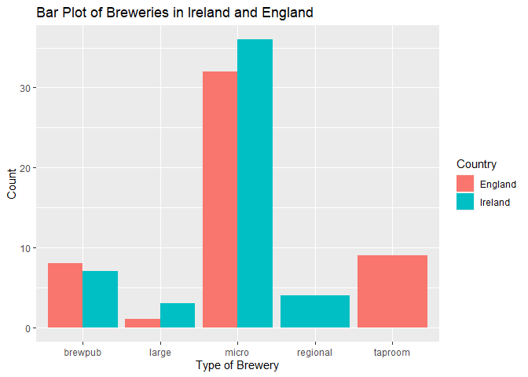
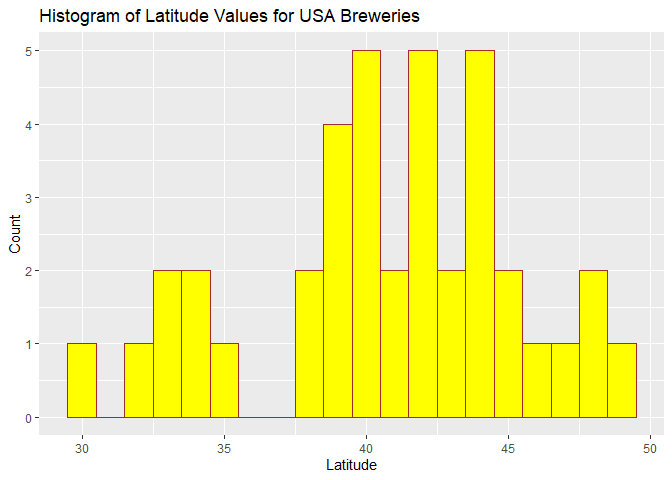
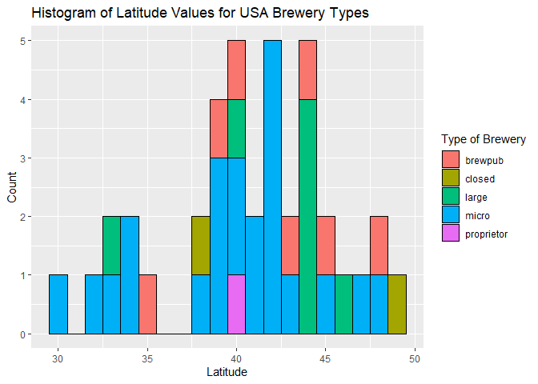
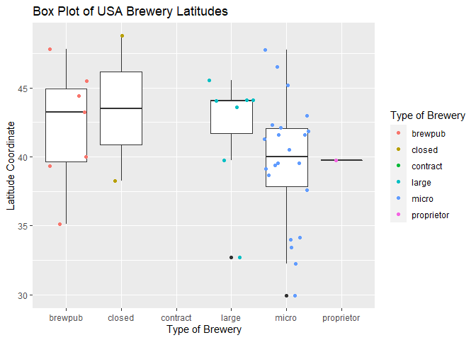

ST 558 Project 2
================
Melanie Kahn & Bennett McAuley

-   <a href="#overview" id="toc-overview">Overview</a>
-   <a href="#requirements" id="toc-requirements">Requirements</a>
-   <a href="#the-data" id="toc-the-data">The Data</a>
-   <a href="#function-definitions" id="toc-function-definitions">Function
    Definitions</a>
    -   <a href="#get_ob_dataframe"
        id="toc-get_ob_dataframe">Get_OB_DataFrame</a>
    -   <a href="#get_ob_random" id="toc-get_ob_random">Get_OB_Random</a>
-   <a href="#exploratory-data-analysis"
    id="toc-exploratory-data-analysis">Exploratory Data Analysis</a>
    -   <a href="#pulling-the-data" id="toc-pulling-the-data">Pulling the
        Data</a>
    -   <a href="#manipulations" id="toc-manipulations">Manipulations</a>
    -   <a href="#summaries" id="toc-summaries">Summaries</a>
    -   <a href="#plots" id="toc-plots">Plots</a>

## Overview

The purpose and overall goal of this vignette is provide instruction on
how to contact an API using functions we created to query, parse, and
return data in a well-structured format. These functions drive a basic
exploratory analysis.

This vignette makes use of the beer data API by the [Open Brewery
DB](https://www.openbrewerydb.org/faq) project.

## Requirements

The following packages should be installed and loaded to run the code
successfully:

-   `httr` - Tools for working with URLs and HTTP
-   `jsonlite` - JSON parser and generator for R
-   `tidyverse` - Collection of packages for data science using “tidy
    data”

## The Data

This section provides the context and structure of the data to get a
better understanding of the contents of the API.

The brewery data from Open Brewery DB features information on breweries,
cideries, brewpubs, and bottleshops around the world. Using the `GET`
function from the `httr` package, a list of breweries is returned.

``` r
library(httr)
breweries <- GET("https://api.openbrewerydb.org/breweries")
str(breweries, max.level = 1)
```

    ## List of 10
    ##  $ url        : chr "https://api.openbrewerydb.org/breweries"
    ##  $ status_code: int 200
    ##  $ headers    :List of 25
    ##   ..- attr(*, "class")= chr [1:2] "insensitive" "list"
    ##  $ all_headers:List of 1
    ##  $ cookies    :'data.frame': 0 obs. of  7 variables:
    ##  $ content    : raw [1:9168] 5b 7b 22 69 ...
    ##  $ date       : POSIXct[1:1], format: "2022-10-11 14:55:47"
    ##  $ times      : Named num [1:6] 0 0.000043 0.000044 0.000113 0.026432 ...
    ##   ..- attr(*, "names")= chr [1:6] "redirect" "namelookup" "connect" "pretransfer" ...
    ##  $ request    :List of 7
    ##   ..- attr(*, "class")= chr "request"
    ##  $ handle     :Class 'curl_handle' <externalptr> 
    ##  - attr(*, "class")= chr "response"

This information isn’t very readable, so we will parse it using the
`FromJSON` function from the `jsonlite` package, and represent the
information as a tibble.

``` r
brew_parsed <- fromJSON(rawToChar(breweries$content))
as_tibble(brew_parsed)
```

    ## # A tibble: 20 × 17
    ##    id     name  brewe…¹ street addre…² addre…³ city  state count…⁴ posta…⁵ country longi…⁶ latit…⁷ phone websi…⁸
    ##    <chr>  <chr> <chr>   <chr>  <chr>   <lgl>   <chr> <chr> <chr>   <chr>   <chr>   <chr>   <chr>   <chr> <chr>  
    ##  1 10-56… 10-5… micro   400 B… <NA>    NA      Knox  Indi… <NA>    46534   United… -86.62… 41.289… 6308… <NA>   
    ##  2 10-ba… 10 B… large   62970… <NA>    NA      Bend  Oreg… <NA>    97701-… United… -121.2… 44.086… 5415… http:/…
    ##  3 10-ba… 10 B… large   1135 … <NA>    NA      Bend  Oreg… <NA>    97703-… United… -121.3… 44.057… 5415… <NA>   
    ##  4 10-ba… 10 B… large   62950… <NA>    NA      Bend  Oreg… <NA>    97701   United… -121.2… 44.091… 5415… <NA>   
    ##  5 10-ba… 10 B… large   826 W… <NA>    NA      Boise Idaho <NA>    83702-… United… -116.2… 43.618… 2083… http:/…
    ##  6 10-ba… 10 B… large   2620 … <NA>    NA      Denv… Colo… <NA>    80205-… United… -104.9… 39.759… 7205… <NA>   
    ##  7 10-ba… 10 B… large   1411 … <NA>    NA      Port… Oreg… <NA>    97209-… United… -122.6… 45.525… 5032… http:/…
    ##  8 10-ba… 10 B… large   1501 … <NA>    NA      San … Cali… <NA>    92101-… United… -117.1… 32.714… 6195… http:/…
    ##  9 10-to… 10 T… micro   490 M… <NA>    NA      Reno  Neva… <NA>    89502   United… -119.7… 39.517… 7755… http:/…
    ## 10 101-b… 101 … brewpub 29479… <NA>    NA      Quil… Wash… <NA>    98376-… United… -122.8… 47.823… 3607… http:/…
    ## 11 101-n… 101 … closed  1304 … <NA>    NA      Peta… Cali… <NA>    94954-… United… -122.6… 38.270… 7077… http:/…
    ## 12 105-w… 105 … micro   1043 … <NA>    NA      Cast… Colo… <NA>    80109-… United… -104.8… 39.382… 3033… http:/…
    ## 13 10k-b… 10K … micro   2005 … <NA>    NA      Anoka Minn… <NA>    55303-… United… -93.38… 45.198… 7633… http:/…
    ## 14 10th-… 10th… micro   491 W… <NA>    NA      Abin… Mass… <NA>    02351-… United… -70.94… 42.105… 7813… http:/…
    ## 15 11-be… 11 B… micro   6820 … <NA>    NA      Hous… Texas <NA>    77066-… United… -95.51… 29.951… 2814… http:/…
    ## 16 1188-… 1188… brewpub 141 E… <NA>    NA      John… Oreg… <NA>    97845-… United… -118.9… 44.414… 5415… http:/…
    ## 17 12-ac… 12 A… micro   Unnam… Clonmo… NA      Kill… <NA>  Laois   R93 X3… Ireland -6.979… 52.849… +353… https:…
    ## 18 12-ga… 12 G… brewpub 80 Ea… <NA>    NA      Will… New … <NA>    14221-… United… <NA>    <NA>    7169… http:/…
    ## 19 12-we… 12 W… micro   3000 … <NA>    NA      Gilb… Ariz… <NA>    85296-… United… <NA>    <NA>    6023… http:/…
    ## 20 12-we… 12 W… micro   <NA>   <NA>    NA      Mesa  Ariz… <NA>    85207   United… -111.5… 33.436… <NA>  <NA>   
    ## # … with 2 more variables: updated_at <chr>, created_at <chr>, and abbreviated variable names ¹​brewery_type,
    ## #   ²​address_2, ³​address_3, ⁴​county_province, ⁵​postal_code, ⁶​longitude, ⁷​latitude, ⁸​website_url

The variables present for each entry in this database are as follows:

-   `id` - The unique ID of the brewery
-   `name`
-   `brewery_type` - The type of brewery; must be one of:
    -   `micro` - Most craft breweries
    -   `nano` - An extremely small brewery that typically only
        distributes locally
    -   `regional` - Regional location of an expanded brewery
    -   `brewpub` - A beer-focused restaurant or bar with a brewery
        on-premise
    -   `planning` - A brewery in planning or not yet opened to the
        public
    -   `contract` - A brewery that uses another brewery’s equipment
    -   `proprietor` - Similiar to contract brewing but refers more to a
        brewery incubator
    -   `closed` - A location that has closed
-   `street` - The street address of the brewery
-   `address_2`
-   `address_3`
-   `city`
-   `state`
-   `county_province`
-   `postal_code`
-   `country`
-   `longitude` - The vertical distance from an origin point
-   `latitude` - The horizontal distance from an origin point
-   `phone`
-   `website_url`
-   `updated_at`
-   `created_at`

Notice that some of the variables provide useful information that can be
applied to data analysis; some cannot (`website_url`, for instance).
This will be addressed by the functions (*see below*) that will query
the data and return tibbles that are analysis-ready.

[Back to Top](#top)

## Function Definitions

This section is dedicated to showcasing all of the functions go into
contacting the API, querying data, and performing our basic exploratory
analysis.

### Get_OB_DataFrame

The `Get_OB_DataFrame` function contacts the API, runs a query based on
values provided by the user, parses the data from the query, and returns
a tibble with relevant and well-formatted variables. It takes the
following arguments:

-   `size` - The number of breweries to return as observations (default
    is `10`)
-   `search_by` - The category of filtering to be applied to the search.
    Valid options are:
    -   `"city"`
    -   `"state"`
    -   `"country"`
    -   `"type"` (*`brewery_type`, see above for values*)
    -   `"name"`
    -   `"dist"` (\_must be denoted by
        `"<latitude>,<longitude>"`–e.g. `"45,37"`)
-   `input` - The value or term to be searched for

*Note: In testing, it was discovered that the querying functionality is
not case sensitive (i.e. `"raleigh"`, `"Raleigh"`, and `"RALEIGH"` will
all return the same thing), so inputting the values in sentence case is
not necessary. Inputting them in quotations on function call, however,
is.*

``` r
Get_OB_DataFrame <- function(size = 10, search_by, input) {
  if (search_by %in% c("city", "state", "country", "type", "name", "dist")) {
    query <- GET(paste0("https://api.openbrewerydb.org/breweries?by_", search_by, "=", input, "&per_page=", size))
  } else {
    stop("Invalid search category. Please use one of these options: 'city', 'state', 'country', 'type' 'name', or 'dist'.")
  }

  query_parse <- fromJSON(rawToChar(query$content))
  
  dt <- as_tibble(query_parse) %>%
    select(id, name, brewery_type, city, state, county_province, country, latitude, longitude) %>%
    mutate(brewery_type = as.factor(brewery_type), longitude = as.numeric(longitude), latitude = as.numeric(latitude)) %>%
    arrange(name)
  
  return(dt)
}
```

#### Usage Examples:

``` r
Get_OB_DataFrame(size = 50, search_by = "city", input = "Dublin") #returns 12 breweries in cities called 'Dublin'--not just the one in Ireland! Despite 50 being asked for, there are only 12 that match the query
Get_OB_DataFrame(7, "state", "North Carolina") #returns 7 breweries in North Carolina
Get_OB_DataFrame(search_by = "country", input = "South Korea") #returns default number of breweries in South Korea
Get_OB_DataFrame(size = 20, "type", "nano") #return 5 nano breweries since only 5 match the query
Get_OB_DataFrame(search_by = "name", input = "wine") #returns default number of breweries with the term 'wine' contained within their names
Get_OB_DataFrame(size = 5, "dist", "41.9,12.4") #returns 5 closest breweries (that have non-NA values) to specified coordinates -- Lat 41.9, Long 12.4 (Rome, Italy)
```

[Back to Top](#top)

### Get_OB_Random

`Get_OB_Random` is functionally identical to `Get_OB_DataFrame`, but
instead of the user specifying characteristics they want in the data,
the observations are queried at random based on the following argument:

-   `n` - The number of breweries to return as observations (default is
    `5`). According to the API documentation, the maximum is `50`.

*Note: In testing, it was verified that the randomness in the API is not
really random; there is a seed associated with it as the queries yielded
the same results per value of `n`, regardless of whether a seed was
speicifed in the R environment.*

``` r
Get_OB_Random <- function(n = 5) {
  
  query <- GET(paste0("https://api.openbrewerydb.org/breweries/random?size=", n))

  query_parse <- fromJSON(rawToChar(query$content))
  
  dt <- as_tibble(query_parse) %>%
    select(id, name, brewery_type, city, state, county_province, country, latitude, longitude) %>%
    mutate(brewery_type = as.factor(brewery_type), longitude = as.numeric(longitude), latitude = as.numeric(latitude)) %>%
    arrange(name)
    
  
  return(dt)
}
```

#### Usage Examples

``` r
Get_OB_Random() #returns default number of randomly selected breweries
Get_OB_Random(20) #returns 20 randomly selected breweries
Get_OB_Random(75) #returns 50 randomly selected breweries; API will still execute the query, but caps the number of observations returned at 50
```

[Back to Top](#top)

## Exploratory Data Analysis

### Pulling the Data

First, we will pull data from the API to create new tibbles using the
`Get_OB_DataFrame()` function to contact, query, and parse the API data.
`CA_Brew` is a new tibble with 50 breweries in the state of California;
`IreEng_Brew` is a new tibble with 100 breweries, 50 in Ireland and 50
in England; and `USA_Brew` is a new tibble with 50 breweries located
within the United States.

``` r
CA_Brew <- Get_OB_DataFrame(size = 50, search_by = "state", input = "California")
CA_Brew
```

    ## # A tibble: 50 × 9
    ##    id                                          name          brewe…¹ city  state count…² country latit…³ longi…⁴
    ##    <chr>                                       <chr>         <fct>   <chr> <chr> <lgl>   <chr>     <dbl>   <dbl>
    ##  1 10-barrel-brewing-co-san-diego              10 Barrel Br… large   San … Cali… NA      United…    32.7   -117.
    ##  2 101-north-brewing-company-petaluma          101 North Br… closed  Peta… Cali… NA      United…    38.3   -123.
    ##  3 14-cannons-brewing-company-westlake-village 14 Cannons B… micro   West… Cali… NA      United…    34.2   -119.
    ##  4 1850-brewing-company-mariposa               1850 Brewing… micro   Mari… Cali… NA      United…    37.6   -120.
    ##  5 2-tread-brewing-co-santa-rosa               2 Tread Brew… brewpub Sant… Cali… NA      United…    38.4   -123.
    ##  6 21st-amendment-brewery-san-leandro          21st Amendme… region… San … Cali… NA      United…    37.7   -122.
    ##  7 21st-amendment-brewery-cafe-san-francisco   21st Amendme… brewpub San … Cali… NA      United…    37.8   -122.
    ##  8 2kids-brewing-company-san-diego             2Kids Brewin… micro   San … Cali… NA      United…    32.9   -117.
    ##  9 3-disciples-brewing-sebastopol              3 Disciples … micro   Seba… Cali… NA      United…    38.4   -123.
    ## 10 3-iron-brewing-company-colton               3 Iron Brewi… micro   Colt… Cali… NA      United…    34.1   -117.
    ## # … with 40 more rows, and abbreviated variable names ¹​brewery_type, ²​county_province, ³​latitude, ⁴​longitude

``` r
IRE_Brew <- Get_OB_DataFrame(size = 50, search_by = "country", input = "Ireland")
ENG_Brew <- Get_OB_DataFrame(size = 50, search_by = "country", input = "England")
IreEng_Brew <- rbind(IRE_Brew, ENG_Brew)
IreEng_Brew
```

    ## # A tibble: 100 × 9
    ##    id                                       name             brewe…¹ city  state count…² country latit…³ longi…⁴
    ##    <chr>                                    <chr>            <fct>   <chr> <lgl> <chr>   <chr>     <dbl>   <dbl>
    ##  1 12-acres-brewing-company-killeshin       12 Acres Brewin… micro   Kill… NA    Laois   Ireland    52.8   -6.98
    ##  2 5-lamps-brewery-dublin                   5 Lamps Brewery  region… Dubl… NA    Dublin  Ireland    53.3   -6.27
    ##  3 9-white-deer-brewery-macroom             9 White Deer Br… micro   Macr… NA    Cork    Ireland    51.9   -9.15
    ##  4 ballykilcavan-brewing-company-stradbally Ballykilcavan B… micro   Stra… NA    Laois   Ireland    53.0   -7.12
    ##  5 barrelhead-brewery-dublin                Barrelhead Brew… micro   Dubl… NA    Dublin  Ireland    53.4   -6.24
    ##  6 beamish-and-crawford-heineken-cork       Beamish and Cra… large   Cork  NA    Cork    Ireland    51.9   -8.48
    ##  7 black-donkey-brewing-ballinlough         Black Donkey Br… micro   Ball… NA    Roscom… Ireland    53.7   -8.64
    ##  8 blacks-brewery-kinsale                   Blacks Brewery   micro   Kins… NA    Cork    Ireland    51.7   -8.52
    ##  9 bo-bristle-brewing-co-banagher           Bo Bristle Brew… micro   Bana… NA    Offaly  Ireland    53.2   -7.99
    ## 10 boghopper-brewery-muff                   Boghopper Brewe… micro   Muff  NA    Donegal Ireland    55.1   -7.26
    ## # … with 90 more rows, and abbreviated variable names ¹​brewery_type, ²​county_province, ³​latitude, ⁴​longitude

``` r
USA_Brew <- Get_OB_DataFrame(size = 50, search_by = "country", input = "United States")
USA_Brew
```

    ## # A tibble: 50 × 9
    ##    id                                  name                  brewe…¹ city  state count…² country latit…³ longi…⁴
    ##    <chr>                               <chr>                 <fct>   <chr> <chr> <lgl>   <chr>     <dbl>   <dbl>
    ##  1 10-56-brewing-company-knox          10-56 Brewing Company micro   Knox  Indi… NA      United…    41.3   -86.6
    ##  2 10-barrel-brewing-co-bend-1         10 Barrel Brewing Co  large   Bend  Oreg… NA      United…    44.1  -121. 
    ##  3 10-barrel-brewing-co-bend-2         10 Barrel Brewing Co  large   Bend  Oreg… NA      United…    44.1  -121. 
    ##  4 10-barrel-brewing-co-portland       10 Barrel Brewing Co  large   Port… Oreg… NA      United…    45.5  -123. 
    ##  5 10-barrel-brewing-co-san-diego      10 Barrel Brewing Co  large   San … Cali… NA      United…    32.7  -117. 
    ##  6 10-barrel-brewing-co-bend-pub-bend  10 Barrel Brewing Co… large   Bend  Oreg… NA      United…    44.1  -121. 
    ##  7 10-barrel-brewing-co-boise-boise    10 Barrel Brewing Co… large   Boise Idaho NA      United…    43.6  -116. 
    ##  8 10-barrel-brewing-co-denver-denver  10 Barrel Brewing Co… large   Denv… Colo… NA      United…    39.8  -105. 
    ##  9 10-torr-distilling-and-brewing-reno 10 Torr Distilling a… micro   Reno  Neva… NA      United…    39.5  -120. 
    ## 10 101-brewery-quilcene                101 Brewery           brewpub Quil… Wash… NA      United…    47.8  -123. 
    ## # … with 40 more rows, and abbreviated variable names ¹​brewery_type, ²​county_province, ³​latitude, ⁴​longitude

[Back to Top](#top)

### Manipulations

A new variable column named `regions` is added to the California
breweries tibble `CA_Brew` that further categorizes the breweries
according to their location in California. Historically, the state is
separated into Northern and Southern California based on their
geography. The Northern California region is mountainous and volcanic
causing more dynamic weather, whereas Southern California is flat with
gradual faults and arid deserts. The administrative line that connects
San Luis Obispo, Kern, and San Bernardino counties creates the boundary
between the two regions. The latitude measurement for this boundary line
is 35.8°N. Therefore, to create this new variable, and brewery with a
latitude less than or equal to 35.8 is located in the Southern region of
California while anything greater than 35.8 is located in the Northern
region of California.

``` r
CA_Brew$regions <- ifelse(CA_Brew$latitude <= 35.8, "Southern", "Northern")
CA_Brew
```

    ## # A tibble: 50 × 10
    ##    id                                          name  brewe…¹ city  state count…² country latit…³ longi…⁴ regions
    ##    <chr>                                       <chr> <fct>   <chr> <chr> <lgl>   <chr>     <dbl>   <dbl> <chr>  
    ##  1 10-barrel-brewing-co-san-diego              10 B… large   San … Cali… NA      United…    32.7   -117. Southe…
    ##  2 101-north-brewing-company-petaluma          101 … closed  Peta… Cali… NA      United…    38.3   -123. Northe…
    ##  3 14-cannons-brewing-company-westlake-village 14 C… micro   West… Cali… NA      United…    34.2   -119. Southe…
    ##  4 1850-brewing-company-mariposa               1850… micro   Mari… Cali… NA      United…    37.6   -120. Northe…
    ##  5 2-tread-brewing-co-santa-rosa               2 Tr… brewpub Sant… Cali… NA      United…    38.4   -123. Northe…
    ##  6 21st-amendment-brewery-san-leandro          21st… region… San … Cali… NA      United…    37.7   -122. Northe…
    ##  7 21st-amendment-brewery-cafe-san-francisco   21st… brewpub San … Cali… NA      United…    37.8   -122. Northe…
    ##  8 2kids-brewing-company-san-diego             2Kid… micro   San … Cali… NA      United…    32.9   -117. Southe…
    ##  9 3-disciples-brewing-sebastopol              3 Di… micro   Seba… Cali… NA      United…    38.4   -123. Northe…
    ## 10 3-iron-brewing-company-colton               3 Ir… micro   Colt… Cali… NA      United…    34.1   -117. Southe…
    ## # … with 40 more rows, and abbreviated variable names ¹​brewery_type, ²​county_province, ³​latitude, ⁴​longitude

A new variable column named `regions` is also added to the USA breweries
tibble `USA_Brew` that further categorizes the breweries according to
their location in the United States. Using the Census Bureau’s [list of
states by regions and
division](https://www2.census.gov/geo/pdfs/maps-data/maps/reference/us_regdiv.pdf),
a vector was created for each region and used to populate the `regions`
variable by searching the `state` column for any state corresponding
with it. Any row with a `state` not corresponding to a region will
return `ERROR` in the new column.

``` r
USA_Brew <- USA_Brew %>% 
  mutate(regions = if_else(state %in% c("Connecticut", "Maine", "Massachusetts", "New Hampshire", "Rhode Island", "Vermont", "New Jersey", "New York", "Pennsylvania"), "Northeast",
                           ifelse(state %in% c("Indiana", "Illinois", "Michigan", "Ohio", "Wisconsin", "Iowa", "Kansas", "Minnesota", "Missouri", "Nebraska", "North Dakota", "South Dakota"), "Midwest",
                                  if_else(state %in% c("Delaware", "District of Columbia", "Florida", "Geogria", "Maryland", "North Carolina", "South Carolina", "Virginia", "West Virginia", "Alabama", "Kentucky", "Mississippi", "Tennessee", "Arkansas", "Louisiana", "Oklahoma", "Texas"), "South",
                                          if_else(state %in% c("Arizona", "Colorado", "Idaho", "New Mexico", "Montana", "Utah", "Nevada", "Wyoming", "Alaska", "California", "Hawaii", "Oregon", "Washington"), "West", "ERROR")))))
USA_Brew
```

    ## # A tibble: 50 × 10
    ##    id                                  name          brewe…¹ city  state count…² country latit…³ longi…⁴ regions
    ##    <chr>                               <chr>         <fct>   <chr> <chr> <lgl>   <chr>     <dbl>   <dbl> <chr>  
    ##  1 10-56-brewing-company-knox          10-56 Brewin… micro   Knox  Indi… NA      United…    41.3   -86.6 Midwest
    ##  2 10-barrel-brewing-co-bend-1         10 Barrel Br… large   Bend  Oreg… NA      United…    44.1  -121.  West   
    ##  3 10-barrel-brewing-co-bend-2         10 Barrel Br… large   Bend  Oreg… NA      United…    44.1  -121.  West   
    ##  4 10-barrel-brewing-co-portland       10 Barrel Br… large   Port… Oreg… NA      United…    45.5  -123.  West   
    ##  5 10-barrel-brewing-co-san-diego      10 Barrel Br… large   San … Cali… NA      United…    32.7  -117.  West   
    ##  6 10-barrel-brewing-co-bend-pub-bend  10 Barrel Br… large   Bend  Oreg… NA      United…    44.1  -121.  West   
    ##  7 10-barrel-brewing-co-boise-boise    10 Barrel Br… large   Boise Idaho NA      United…    43.6  -116.  West   
    ##  8 10-barrel-brewing-co-denver-denver  10 Barrel Br… large   Denv… Colo… NA      United…    39.8  -105.  West   
    ##  9 10-torr-distilling-and-brewing-reno 10 Torr Dist… micro   Reno  Neva… NA      United…    39.5  -120.  West   
    ## 10 101-brewery-quilcene                101 Brewery   brewpub Quil… Wash… NA      United…    47.8  -123.  West   
    ## # … with 40 more rows, and abbreviated variable names ¹​brewery_type, ²​county_province, ³​latitude, ⁴​longitude

[Back to Top](#top)

### Summaries

#### Categorical: Contingency Tables

The code chunk below creates a two-way contingency table showing the
number of each type of brewery (from the `brewery_type` variable) per
region (from the `regions` variable) for the 50 random breweries
selected in California (`CA_Brew`) using the `table()` function.

The first row of this contingency table indicates that of the 14
brewpubs observed in this data set, 5 are located in Northern
California, while the other 9 are located in Southern California.

``` r
table(CA_Brew$brewery_type, CA_Brew$regions)
```

    ##           
    ##            Northern Southern
    ##   brewpub         5        9
    ##   closed          1        2
    ##   contract        1        0
    ##   large           1        1
    ##   micro          13       13
    ##   planning        1        1
    ##   regional        1        1

The code chunk below creates a one-way contingency table showing the
number of each type of brewery (from the `brewery_type` variable) in the
data set with 50 random breweries selected in the United States
(`USA_Brew`) using the `table()` function.

This contingency table indicates that there are 9 brewpubs, 2 closed, 1
contract, 7 large, 30 micro, and 1 proprietor brewery in the USA data.

``` r
table(USA_Brew$brewery_type)
```

    ## 
    ##    brewpub     closed   contract      large      micro proprietor 
    ##          9          2          1          7         30          1

The code chunk below creates a two-way contingency table showing the
number of each type of brewery (from the `brewery_type` variable) per
region (from the `regions` variable) for the 50 random breweries
selected in the United States (`USA_Brew`) using the `table()` function.

The first row of this contingency table indicates that of the 9 brewpubs
observed in this data set, 1 is located in the Midwest, 2 are located in
the Northeast, 2 are located in the South, and 4 are located in the
West.

``` r
table(USA_Brew$brewery_type, USA_Brew$regions)
```

    ##             
    ##              Midwest Northeast South West
    ##   brewpub          1         2     2    4
    ##   closed           0         0     0    2
    ##   contract         0         0     1    0
    ##   large            0         0     0    7
    ##   micro           10         6     5    9
    ##   proprietor       0         0     0    1

The code chunk below creates a two-way contingency table showing the
number of each type of brewery (from the `brewery_type` variable) per
`country` for the 100 random breweries selected in Ireland and England
(`IreEng_Brew`) using the `table()` function.

This contingency table indicates that micro breweries are by far the
most popular in both countries (32 in England and 36 in Ireland),
taprooms are more popular in England (9 in England and none in Ireland),
and regional breweries are more popular in Ireland (none in England and
4 in Ireland).

``` r
table(IreEng_Brew$brewery_type, IreEng_Brew$country)
```

    ##           
    ##            England Ireland
    ##   brewpub        8       7
    ##   large          1       3
    ##   micro         32      36
    ##   regional       0       4
    ##   taproom        9       0

[Back to Top](#top)

#### Quantitative: Numerical Summaries

Running the code chunk below creates a summary statistics table showing
the average (`mean()`) and median (`median()`) for the latitude and
longitude values in the United States breweries according to `state`
rounded to the nearest hundredth.

The second row indicates that, according to the 50 random breweries
selected from the United States to make up the `USA_Brew` data set,
breweries in California have average coordinates of (35.68°N, 119.63°W)
and median coordinates of (35.86°N, 119.35°W).

``` r
USA_Brew2 <- USA_Brew %>%
  group_by(state) %>%
  summarize(Avg_Lat = round(mean(latitude), digits = 2),
            Avg_Long = round(mean(longitude), digits = 2),
            Median_Lat = round(median(latitude), digits = 2),
            Median_Long = round(median(longitude), digits = 2))
USA_Brew2
```

    ## # A tibble: 25 × 5
    ##    state         Avg_Lat Avg_Long Median_Lat Median_Long
    ##    <chr>           <dbl>    <dbl>      <dbl>       <dbl>
    ##  1 Arizona          NA       NA         NA          NA  
    ##  2 California       35.7   -120.        35.9      -119. 
    ##  3 Colorado         39.7   -105.        39.8      -105. 
    ##  4 Delaware         38.7    -75.4       38.7       -75.4
    ##  5 Idaho            43.6   -116.        43.6      -116. 
    ##  6 Illinois         39.5    -89.0       39.5       -89.0
    ##  7 Indiana          41.5    -87.1       41.6       -87.3
    ##  8 Maryland         NA       NA         NA          NA  
    ##  9 Massachusetts    42.1    -71.0       42.1       -71.0
    ## 10 Michigan         42.3    -84.4       42.3       -84.4
    ## # … with 15 more rows

[Back to Top](#top)

### Plots

#### Bar Plot

Running the code chunk below creates a side-by-side bar plot to
visualize the relationship between the brewery types (`brewery_type`)
and location (`country`) for the observations in the Irish and English
breweries data set (`IreEng_Brew`). The `stat` argument within
`geom_bar` is set to `"count"`, `brewery_type` is set to the x-axis, and
the `fill` is set to the `country` variable, telling R to count and plot
the number each type of brewery per country. The `brewery_type` and
`country` variables were titled accordingly on the x-axis and in the
legend, the `count` variable has been capitalized, and the plot itself
was titled `"Bar Plot of Breweries in Ireland and England"`.

As mentioned above in the discussion of this bar plot’s corresponding
two-way contingency table, the resulting bar graph again shows that most
breweries in Ireland and England are microbreweries, indicating the
craft beer is most popular in both countries.

``` r
g <- ggplot(data = IreEng_Brew, aes(x = brewery_type, fill = country))
g + geom_bar(stat = "count", position = "dodge") +
  labs(title = "Bar Plot of Breweries in Ireland and England", x = "Type of Brewery", y = "Count") +
  scale_fill_discrete(name = "Country")
```

<!-- -->

[Back to Top](#top)

#### Histograms

Running the code chunk below creates a histogram to visualize the
distribution of latitude values for observations in the USA breweries
tibble (`latitude` in `USA_Brew`). Since there are 11 observations in
the data set which have missing values for their coordinates, these NA
values are dropped from the data before plotting (`na.rm = TRUE`). The
width of the bins (`binwidth`) is set to 1 for better visualization of
the data, while the colors of the bins and their outline are set to
yellow and brown respectively. The `count` and `latitude` variables have
been capitalized, and the plot itself was titled
`"Histogram of Latitude Values for USA Breweries"`.

The resulting histogram shows that most breweries in the US are located
between 39°N and 44°N, which is mostly in the northern United States.

``` r
g2 <- ggplot(USA_Brew, aes(x = latitude))
g2 + geom_histogram(binwidth = 1, na.rm = TRUE, color = "brown", fill = "yellow") +
  labs(title = "Histogram of Latitude Values for USA Breweries", x = "Latitude", y = "Count")
```

<!-- -->

Running the code chunk below modifies the previous histogram to
visualize the distribution of latitude values by type of brewery for
observations in the USA breweries tibble (`latitude` and `brewery_type`
in `USA_Brew`). Changes to the previous code include assigning the fill
colors of the bins according to brewery type, setting the bin outline to
black for readability, updating the histogram’s title to account for the
modifications, and fix the legend title.

The resulting histogram confirms prior analysis that microbreweries are
the most popular overall, but also shows that large breweries are
predominantly located in the northern United States near the 44th
parallel (44°N).

``` r
g3 <- ggplot(USA_Brew, aes(x = latitude, fill = brewery_type))
g3 + geom_histogram(binwidth = 1, na.rm = TRUE, color = "black") +
  labs(title = "Histogram of Latitude Values for USA Brewery Types", x = "Latitude", y = "Count", fill = "Type of Brewery")
```

<!-- -->

[Back to Top](#top)

#### Box Plot

Running the code chunk below creates a box plot to visualize the
five-number summary for the relationship between the USA brewery
latitudes and the type of brewery. Each box plots displays the minimum,
lower quartile (Q1), median, upper quartile (Q3), and maximum values for
`latitude` according to `brewery_type`. Jittered points were added to
the box plot to visualize the underlying distribution of latitude data
presented by the box plots and were color coordinated by type of brewery
in the legend.

The resulting box plot shows that the median latitude coordinates for
the 50 breweries within our `USA_Brew` data are very close in value for
brewpubs, closed, and large breweries, and are greater than (more
northerly than) the median latitude coordinates for US microbreweries.
Within our data set, there is only 1 contract and 1 proprietor brewery,
so no boxplot can be created for these two types as there is no
distribution available to plot.

The lengths of the boxes indicate that the interquartile range for
brewpubs and closed breweries are similar, and larger than the IQR for
micro and large breweries. While this is true, microbreweries have a
larger overall range of `latitude` data, echoed by the fact that there
are more microbreweries in the US data set than any other type by far.
The data for those microbreweries therefore has more variation in
latitude values, although variation is similar in the brewpud and closed
brewery types.

Outliers with smaller latitude coordinates (breweries located further
south) are also indicated by the point in the large and micro box plots.

Both the brewpub and large brewery box plots are skewing right, while
the closed and micro brewery box plots appear to be symmetrical
indicating a fairly normal distribution for `latitude` data across these
brewery types.

``` r
g4 <- ggplot(USA_Brew, aes(x = brewery_type, y = latitude))
g4 + geom_boxplot(na.rm = TRUE) +
  geom_jitter(na.rm = TRUE, aes(color = brewery_type)) +
  labs(title = "Box Plot of USA Brewery Latitudes", x = "Type of Brewery", y = "Latitude Coordinate", color = "Type of Brewery")
```

<!-- -->

[Back to Top](#top)

#### Scatter Plot

Running the code chunk below creates a scatter plot to visualize the
correlation between the `latitude` and `longitude` coordinates for the
50 random breweries collected in the `CA_Brew` data set. The
`geom_point()` function plots the data points while the `geom_smooth()`
function plots the regression line using method `lm` for linear model.
The color of the data points has been changed according to the region
the breweries are located in.

The resulting scatter plot shows a strong, negative linear correlation
between latitude and longitude data with breweries in Northern
California at the bottom right of the plot corresponding to larger
latitude values and “smaller” longitude values. This is an expected
result, as coordinate lines with negative numbers do not actually
represent smaller values. Instead, the larger negative values indicate a
greater distance west of the Prime Meridian for longitude, and greater
distance south of the Equator for latitude. Since California is located
in the northern hemisphere of the globe, Northern California should have
“larger” latitudinal values that are positive (further from the
Equator). The shape and right-curvature of California coupled with its
geographic location in the western hemisphere also tells us that
Southern California should have “smaller” longitudinal values that are
negative as they are closer to the Prime Meridian.

``` r
g5 <- ggplot(CA_Brew, aes(x = latitude, y = longitude))
g5 + geom_point(aes(color = regions)) +
  geom_smooth(method = lm, col = "Blue") +
  labs(title = "Latitude Longitude Coordinates of California Breweries", x = "Latitude", y = "Longitude", color = "Regions")
```

    ## `geom_smooth()` using formula 'y ~ x'

<!-- -->

[Back to Top](#top)
